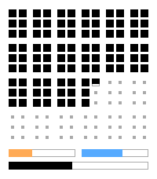
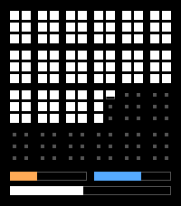
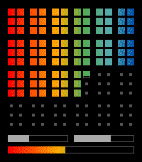

keep track of the time visually, every ten pixel is a minute.
every ten by ten block is ten minutes.
144 blocks in one day.

keep track visually of your month (orange), year (blue) and life at the bottom.

light-mode:

dark-mode:

rainbow:

the life-bar plus the outlook of where you are in the day, month, and year is a gentle reminder to act and be a little brave in your life.

time clocks ten minutes at a time.

inspired by the great classic watchface 1440.